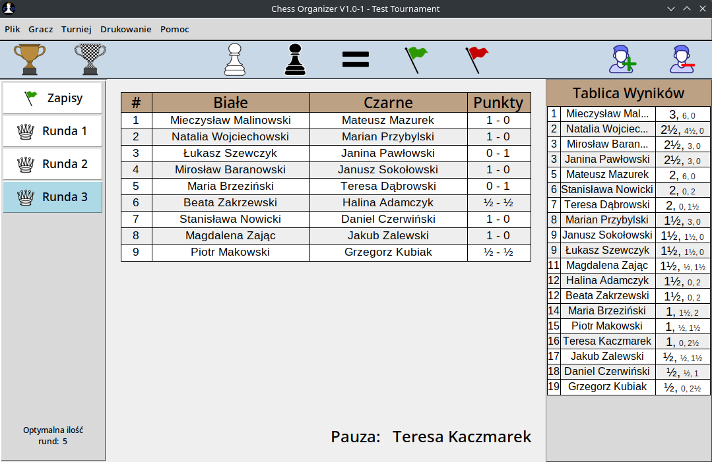

# Chess tournament Organizer

It's a simple
[Swiss-system](https://en.wikipedia.org/wiki/Swiss-system_tournament)
tournament organizer application focused on chess tournaments.

Pairs players based on rules of swiss pairing and uses
[Buchholz scoring system](https://en.wikipedia.org/wiki/Buchholz_system)
as a tie-breaking system. The program stores a database of passed
tournaments and created players. Only polish language is supported.

Made to be used in school chess tournaments.

    

